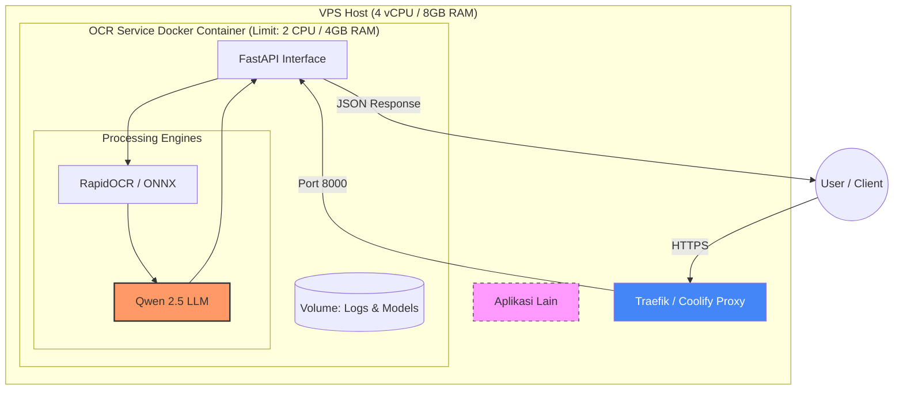
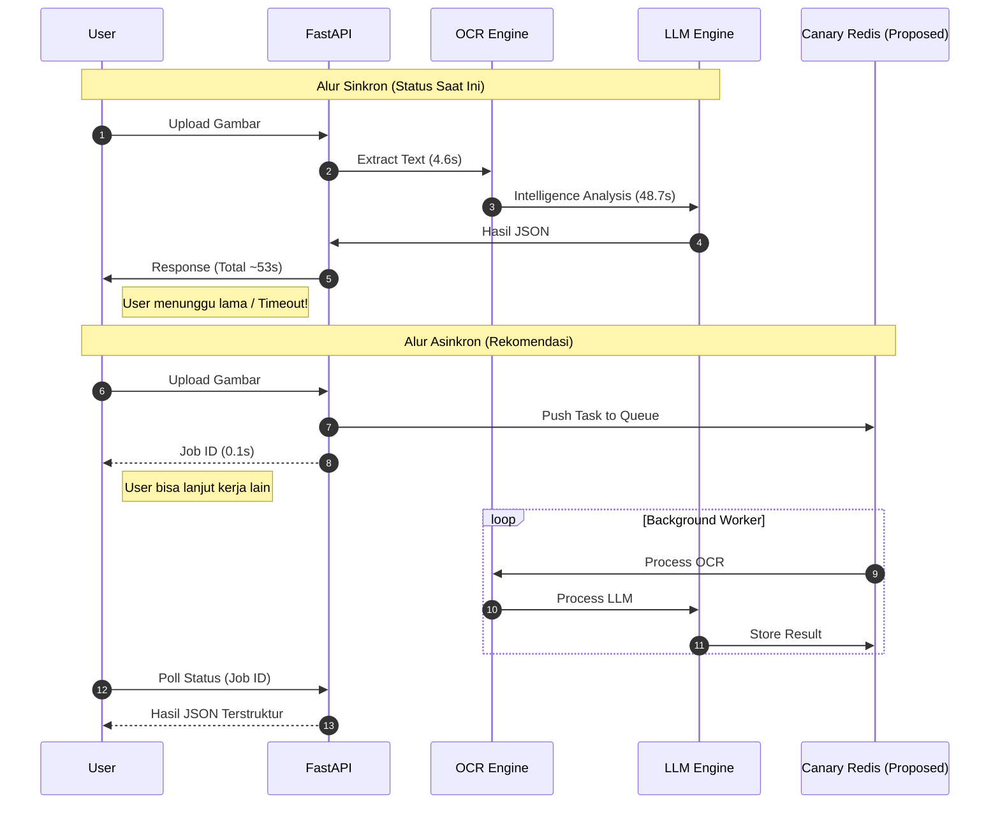

# Laporan Analisis Performa & Strategi Implementasi OCR Service

## 0. Diagram Arsitektur & Alur Kerja

### A. Arsitektur Sistem (Isolation & Shared Hosting)
Diagram ini menunjukkan bagaimana layanan OCR terisolasi di dalam VPS yang digunakan bersama aplikasi lain.

### B. Alur Kerja: Sinkron (Saat Ini) vs Asinkron (Rekomendasi)
Menunjukkan perbedaan *latency* yang dirasakan oleh pengguna berdasarkan hasil pengujian.

---

## 1. Performance Benchmark (Hasil Implementasi)
**Environment**: 4 vCPU | 8 GB RAM (VPS - Shared with other apps)
**Constraint**: Container limited to 2 vCPU / 4 GB RAM

| Metric | Value | Note |
| :--- | :--- | :--- |
| **Total Processing Time** | **53.44 seconds** | End-to-end (OCR + LLM) |
| **OCR (RapidOCR)** | 4.64 seconds | Text extraction phase |
| **LLM (Qwen 2.5 0.5B)** | 48.70 seconds | Intelligence/Extraction phase |
| **LLM Throughput** | **3.14 tokens/sec** | Running on CPU only |
| **Context Size** | 1,344 tokens | Prompt + Completion |

### Analisis Hasil:
*   **Efisiensi OCR**: Proses OCR sangat cepat (~4.6s), hanya memakan **8.7%** dari total waktu. Model ini sangat bisa diandalkan untuk ekstraksi teks dasar.
*   **LLM Bottleneck**: Fase LLM memakan **91.3%** waktu. Meskipun 3.14 tokens/s sudah optimal untuk CPU, waktu tunggu 50 detik terlalu lama untuk request HTTP sinkron.
*   **Konteks Shared Hosting**: Karena VPS digunakan bersama aplikasi lain, limitasi resource (2 CPU / 4G RAM) diterapkan agar layanan ini tidak mengganggu performa aplikasi lain di server yang sama.

---

## 2. Strategi Isolasi Resource
Untuk menjaga stabilitas server (terutama pada VPS), strategi isolasi berikut telah diterapkan:

### A. Hard Resource Caps (Docker)
Membatasi container hanya menggunakan **50% dari kapasitas server**:
*   **CPU Limit (2.0)**: Mencegah proses LLM memonopoli CPU host yang bisa menyebabkan aplikasi lain hang.
*   **Memory Limit (4G)**: Mencegah kebocoran memori atau model besar memicu OOM (Out of Memory) pada sistem host.

### B. Security & Runtime Isolation
*   **Non-Root Execution**: Aplikasi berjalan di bawah user khusus untuk keamanan.
*   **Multi-Stage Build**: Image akhir hanya berisi dependensi runtime, memperkecil footprint memori.

---

## 3. Optimasi Masa Depan: Async Queue dengan "Canary Redis"
Untuk mengatasi latensi 53 detik, direkomendasikan migrasi ke proses **Asinkron**.

### Mengapa "Canary Redis"?
*   **Lightweight**: Menggunakan instance Redis minimal (alpine) dengan limit memori kecil.
*   **Isolasi Antrian**: Redis ini hanya didedikasikan untuk antrian layanan ini, sehingga tidak akan mengganggu database atau aplikasi lain di VPS yang sama jika terjadi beban tinggi.

---

## 4. Analisis Model: Qwen 0.5B vs 1.5B
Berdasarkan hasil uji coba, pemilihan model sangat bergantung pada kompleksitas dokumen:

### A. Qwen 2.5 0.5B Q4 (Model Saat Ini)
*   Cocok untuk dokumen sederhana dan butuh kecepatan/resource rendah.
*   Dapat diandalkan jika hasil OCR bersih dan field data tidak terlalu banyak.

### B. Qwen 2.5 1.5B Q5_K_M (Rekomendasi Upgrade)
Untuk ekstraksi dokumen yang lebih kompleks:
*   **Intelligence**: Pemahaman konteks lebih baik untuk akurasi ekstraksi yang "bagus dan benar".
*   **Quantization Q5**: Menggunakan bit lebih tinggi untuk akurasi lebih stabil dibanding Q4.
*   **Konsekuensi**: Memerlukan RAM sekitar 2GB dan waktu proses mungkin akan naik tanpa penambahan vCPU.

---

## 5. Kesimpulan Strategis
*   ✅ **Stabilitas**: Berhasil diimplementasikan di server *shared* dengan isolasi aman.
*   ⚠️ **User Experience**: Latensi 50 detik adalah tantangan utama untuk proses sinkron.
*   🚀 **Rekomendasi**: 
    1. Implementasi **Async Task Queue** menggunakan Redis.
    2. Upgrade ke **Qwen 1.5B Q5** untuk dokumen yang membutuhkan akurasi ekstraksi tinggi.
