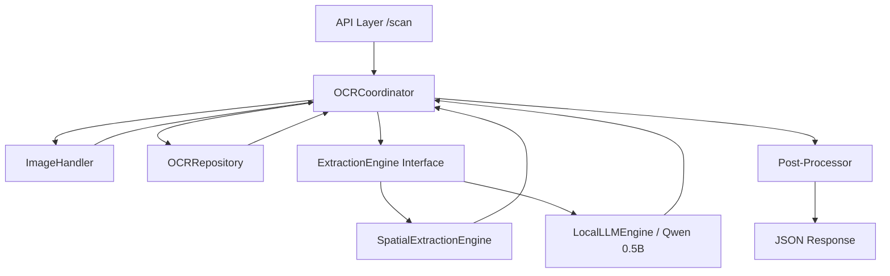

# SnapText Architecture

SnapText follows a **Modular Coordinator** pattern, designed for high-performance OCR and structured data extraction on resource-constrained environments (VPS).

## High-Level Architecture

The system is divided into functional layers that operate in a sequential pipeline orchestrated by the `OCRCoordinator`.

## Functional Layers

### 1. Coordinator Layer (`ocr_service.py`)
Acts as the central orchestrator. It does not contain extraction logic but coordinates data flow between the image handler, OCR repository, and whichever extraction engine is selected via the `use_llm` parameter.

### 2. Image Handler (`image_handler.py`)
Encapsulates all logic for:
- Validation (Size, Format)
- Optimization (Resizing, Quality adjustment)
- Preprocessing (Enhancement filters via `DocumentProcessor`)

### 3. Extraction Engines (`app/services/extraction/`)
A plugin-based system for mapping OCR text into structured objects.
- **Rule-based Engine**: Uses spatial heuristics (distance, alignment) and fuzzy matching for fast, predictable mappings (e.g., standard KTP).
- **Local LLM Engine**: Utilizes **Qwen2.5-0.5B** via `llama-cpp-python` for zero-shot extraction. Highly effective for complex documents like Family Cards (KK) or Invoices without needing templates.

### 4. Repository Layer (`app/repositories/`)
The interface to the underlying OCR engine. Currently implements **RapidOCR** (PaddleOCR wrapper). It focuses solely on identifying text regions and coordinates.

## Data Flow (Hybrid Mode)

1. **Input**: API receives image and `use_llm=true`.
2. **Prep**: `ImageHandler` optimizes the image for OCR (resizing to max 1600px).
3. **Scan**: `OCRRepository` extracts all text regions with bounding boxes.
4. **Layout Analysis**: `LocalLLMEngine` groups regions into logical lines to preserve visual structure.
5. **Extraction**: SLM (Qwen) processes the structured text and returns a cleaned JSON object.
6. **Polish**: `OCRCoordinator` applies final formatting (Title Case, noise removal).

## Performance Optimization

- **Lazy Loading**: LLM models are only loaded into memory when `use_llm` is first called.
- **Quantization**: Uses GGUF (Q4_K_M) format to reduce RAM usage by 75% without significant accuracy loss.
- **CPU Parallelism**: `llama-cpp-python` is configured to use optimal thread counts for VPS CPUs.
